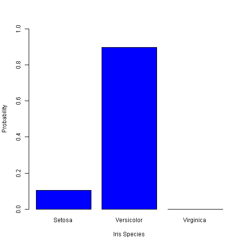

Iris Identifier Pitch
========================================================
author: Eric Oden
date: 8/31/2021
autosize: true
width: 1920
height: 1080
class: small-code

Our Question
========================================================

We have an iris plant, and we know it is either *I. Setosa*,
*I. Versicolor*, or *I. Virginica* (images from Wikipedia):


We can measure its **sepal length**, **sepal width**, **petal length** and **petal
width**. We want to know which specific species of Iris it is.

The Data Set
========================================================

The `iris` data set has measurements for fifty samples each of the three species.


```r
head(iris)
```

```
  Sepal.Length Sepal.Width Petal.Length Petal.Width Species
1          5.1         3.5          1.4         0.2  setosa
2          4.9         3.0          1.4         0.2  setosa
3          4.7         3.2          1.3         0.2  setosa
4          4.6         3.1          1.5         0.2  setosa
5          5.0         3.6          1.4         0.2  setosa
6          5.4         3.9          1.7         0.4  setosa
```

```r
table(iris$Species)
```

```

    setosa versicolor  virginica 
        50         50         50 
```

Our Model
========================================================

Since we wish to choose between three discrete outcomes, we use multinomial
logistic regression. Specifically, we seek a 2 x 5 matrix of coefficients,
$\mathbf{\beta}$, to fit: $$\ln \frac{P(Y_i = \text{Virginica})}{P(Y_i =
\text{Setosa})} = \beta_1 X_i$$ $$\ln \frac{P(Y_i = \text{Versicolor})}{P(Y_i =
\text{Setosa})} = \beta_2 X_i$$ where $X_i$ is the vector of measurements for
observation $i$, $Y_i$ is the species for observation $i$, and $\beta_i$ is the
$i^{\text{th}}$ row of $\mathbf{\beta}$. Note that the choice of `Setosa` as the
'pivot' is arbitrary.

Using the `nnet` package in `R`, this process is a "one-liner":

```r
library(nnet)
model <- multinom(Species ~ ., data = iris)
coefs <- summary(model)$coefficients
```

Our App
========================================================

The `Shiny` app provides a simple interface to enter the plant's measurements 
and observe the probability for each species. The server reads the input, and 
calculates each probability, and produces a bar plot:

```r
        x <- c(4.8, 3.3, 3, 1.4) # hard coded just for showing an example
        setosa_num = 1
        versicolor_num = exp(coefs[1, 1] + coefs[1, 2:5] %*% x) 
        virginica_num = exp(coefs[2, 1] + coefs[2, 2:5] %*% x)
        den = 1 + versicolor_num + virginica_num
        p_setosa = setosa_num / den
        p_versicolor = versicolor_num / den
        p_virginica = virginica_num / den
        names <- c("Setosa", "Versicolor", "Virginica")
        probs <- c(p_setosa, p_versicolor, p_virginica)
        barplot(names.arg = names, height = probs, ylim = c(0, 1), 
                xlab = "Iris Species",
                ylab = "Probability",
                col = "blue")
```




